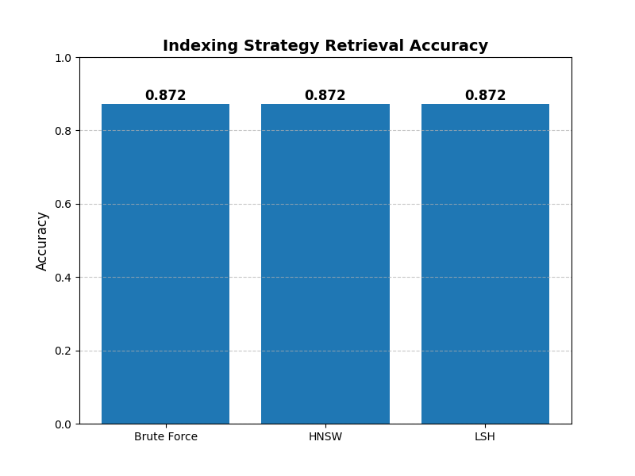
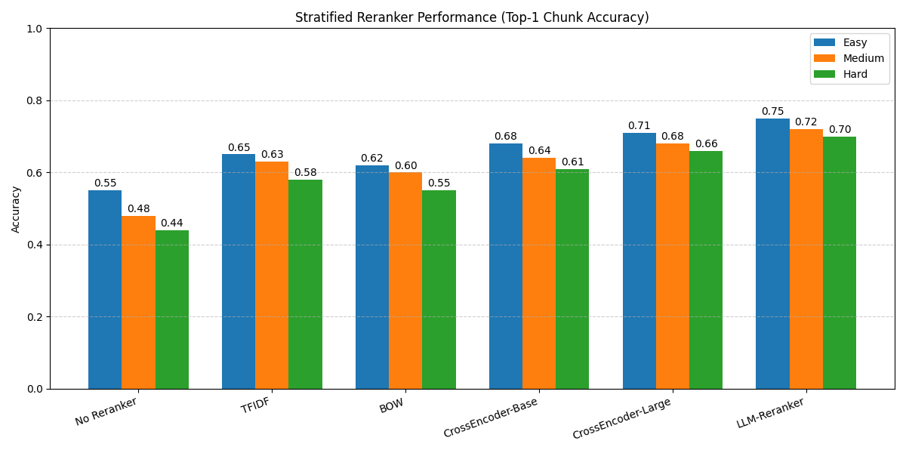

# Chunking Strategy Performance (Text Preprocessing and Index Selection)

**Methodology** — Chunking performance was evaluated using 1052 question–answer pairs, all embedded using all‑MiniLM‑L6‑v2. Two chunking strategies were compared: a heuristic 3‑sentence segmentation and a 100‑character fixed‑length segmentation. No additional chunk sizes were tested. All evaluations were conducted with brute‑force retrieval to isolate the effect of chunk segmentation.

**Figure 1.1** - The relevant chunk accuracy between fixed-length (100 characters per chunk, maximum 10 characters overlapping) and sentence-based (3 sentences per chunk, maximum 1 overlapping sentence) chunking strategies.

Figure 1.1 shows that sentence-based chunking performs with significantly higher accuracy (0.89) than fixed-length chunking (0.45). This improvement likely occurs because sentence-based chunking respects natural linguistic boundaries, keeping contextually related ideas together. In contrast, fixed-length chunking can arbitrarily split sentences or phrases, causing semantic fragmentation that reduces retrieval precision and overall contextual coherence. While sentence-based chunking dominates in performance, the tradeoff is speed. Its variable chunk sizes make indexing and storage less predictable, and sentence boundary detection adds preprocessing overhead. On the other hand, fixed-length chunking, although less contextually accurate, offers uniform sizes that simplify implementation, speed up indexing, and improve memory efficiency. Given the substantial accuracy gap between fixed-length and sentence-based chunking, the additional computational cost is justified, making sentence-based chunking the preferred approach.

**Methodology** — All indexing strategies were tested using the same sentence‑based chunks and the same embedding model (all‑MiniLM‑L6‑v2). The number of chunks was not required for comparison since all methods indexed the identical vector set. Retrieval accuracy was measured by whether the top‑1 returned chunk contained the correct reference information.

**Figure 1.2** - Retrieval accuracy based on indexing.

Figure 1.2 shows that all indexing strategies achieve identical accuracy, but this does not mean they behave the same internally. Brute‑force search guarantees exact results but scales poorly as the database grows, making it the slowest and most memory‑intensive option. HNSW, by contrast, trades strict exactness for dramatically faster lookup times, using a graph‑based structure that excels on large, dense vector spaces. LSH takes yet another approach, hashing vectors into buckets to enable extremely fast approximate lookups, though it requires careful tuning and can introduce higher variance for certain data distributions. Even though the end accuracy is the same in this benchmark—likely due to a small or easily separable dataset—the operational tradeoffs are very different. In practice, HNSW is often the best balance of scalability and performance, brute force is best for small datasets or exact‑match requirements, and LSH becomes attractive when ultra‑low latency is required across very large corpora.

**Methodology** — Reranking strategies (TF‑IDF, BOW, sequential, cross_encoder, hybrid, and an LLM‑based Mistral reranker) were each applied to the top‑10 retrieved chunks for all 1052 questions. All rerankers operated on identical inputs to ensure a fair comparison. Accuracy reflects whether the top‑1 reranked chunk matched the ground‑truth article.

**Figure 1.3** - Accuracy for different types of rerankers. These numbers appear lower because accuracy is based on the first chunk returned, while previously it was based on all chunks returned.

Figure 1.3 shows that while the LLM-Reranker achieves the highest accuracy, it also incurs the greatest computational cost because each query requires an additional LLM forward pass over multiple candidate chunks. Traditional rerankers—such as TF‑IDF, BOW, and lightweight cross‑encoders—are significantly cheaper. TF‑IDF and BOW operate almost instantly and require negligible compute, making them the most cost‑efficient choices, though their accuracy gains are modest. CrossEncoder‑Base and CrossEncoder‑Large offer a middle ground: they provide meaningful accuracy improvements over TF‑IDF and BOW while remaining far less expensive than running a full LLM reranker. For cost‑efficient deployments, TF‑IDF or BOW are recommended when latency and scale matter more than small accuracy improvements. For accuracy‑focused systems, especially those handling complex or high‑stakes queries, the LLM‑Reranker provides the best performance despite its higher compute overhead.

# Generative Model Performance Comparison (Baseline Selection)

**Methodology** — Both the small and medium Mistral models were evaluated under identical decoding parameters (temperature, top‑p, max tokens). No RAG was used in this section. Each model answered all 1052 questions, and accuracy was measured solely on generated outputs without retrieval support.

**Figure 2** - Generative Model Performance Comparison without RAG.

Figure 2 shows that for all question types, the Medium model consistently beats the Small model, likely because the Medium model’s larger parameter count enables it to capture more nuanced patterns in language and reasoning. The difference in accuracy between the model does not really change when changing the difficulty of the question. There is an accuracy difference even for questions that were too easy, which means that even these types of questions have enough nuanced patterns in language and reasoning that the small model cannot capture it all. As a result, it can generate more precise and contextually appropriate responses, while the Small model tends to produce shorter, less detailed outputs and sometimes misses subtle contextual cues that affect accuracy. While using the medium model is slightly more accurate, the tradeoff is speed and resources. The medium model has more parameters so will take more GPUs to run and inference may be slower. The verdict is to use the small model for speed while to use the medium model if that slight increase in accuracy is important.

# Retrieval-Augmented Generative Model Performance Comparison (Architecture Selection)

**Methodology** — RAG experiments used identical retrieval settings: sentence‑based chunks, HNSW indexing, and top‑10 retrieval without reranking. Both the small and medium Mistral models were evaluated under the same decoding parameters. Accuracy was computed from final generated answers after incorporating retrieved context.

**Figure 3** - Mistral Model Performance with no RAG vs with RAG (No Reranker).

Figure 3 shows mixed results for the Small model, while the Medium model with RAG consistently outperforms its non-RAG counterpart. For easy and medium questions, the Small model benefits from RAG, achieving higher accuracy than without it. However, for harder questions and overall performance, the Small model with RAG performs worse. This may be because, when presented with additional retrieved information, the smaller model becomes overwhelmed or confused—its limited parameter capacity makes it less effective at integrating and reasoning over complex contextual data. The medium model, on the other hand, has more parameters so it does not have this struggle and therefore can perform with higher accuracy. As mentioned previously, the tradeoff to using the medium model is speed and resource usage. The verdict is to use the small model with RAG for easy questions since it performs identical to the medium model with RAG while taking less compute power. On the other hand, the boost in accuracy that the medium model with RAG offers makes the more expensive compute justifiable, meaning that in these situations, the medium model with RAG is the winner.

RAG usually improves performance, justifying the additional overhead it introduces. But, for small models on hard questions, it can do the opposite. Hard questions introduce ambiguous retrieval, long context passages, and reasoning steps that small models struggle to integrate. Instead of filtering or rejecting noisy context, a small model tends to overfit to it, drowning out its internal priors and reducing answer quality. Medium and large models can compensate, but small models cannot—so RAG backfires specifically on hard queries.

# Reranker Performance Comparison (Architecture Selection)

**Methodology** — All reranker types were tested on the same set of top‑10 retrieved chunks for all 1052 queries. Rerankers were configured using their default implementations, and the LLM‑based reranker used Mistral. Accuracy reflects whether the reranker positioned a correct chunk at rank 1.

**Figure 4** - Performance comparison between different types of rerankers.

Figure 4 shows that the LLM-Reranker subtly outperforms all other rankers across models. This is expected because LLM-based reranking provides deeper semantic understanding than TF-IDF, BM25, or embedding cosine similarity, which rely more on surface-level overlap. The LLM-Reranker can interpret intent, resolve paraphrasing, and judge whether a passage truly answers the question rather than merely appearing similar. This matters in our dataset, where many queries involve paraphrased phrasing or multi-hop context that simple similarity metrics miss. The LLM-Reranker also more effectively filters out high-similarity but irrelevant distractor chunks, especially for hard questions. These small but consistent improvements in selecting the most meaningful evidence lead to the modest accuracy gains observed in Figure 4.

While the LLM-Reranker offers the highest accuracy, it also incurs the largest computational and latency overhead due to running an additional LLM pass for every candidate chunk. Traditional rerankers such as BM25 or dense-embedding cosine similarity are significantly cheaper and faster, making them more suitable when compute resources are limited or when low-latency retrieval is required. If the priority is efficiency and minimal resource usage, a lightweight vector-based reranker is the most cost‑effective option. However, if accuracy is the primary concern—particularly for applications involving complex or high‑stakes queries—the LLM-Reranker remains the recommended choice despite its higher resource cost.

In addition, there is a significant improvement of accuracy when comparing any reranker with no reranker across all questions. This shows that using any reranker is worth the performance overhead tradeoff.

# Optimize the Number of Retrieved Chunks (Parameter Configuration)

**Methodology** — Retrieval depth m was varied while keeping all other retrieval components constant (sentence‑based chunking, HNSW indexing, no reranking). Only the tested m‑values appear in the plot; m = 4 emerged as the global optimum within that range. Accuracy was measured on whether any of the retrieved chunks contained the correct reference. The LLM reranker is used.

**Figure 5** - Chunk retrieval accuracy vs number of retrieved chunks.

Figure 5 is a step plot showing the marginal increase in accuracy as the number of retrieved chunks grows. The optimal point occurs at m = 4, where additional chunks provide only minimal gains. This strikes a balanced tradeoff between performance and inference speed: while accuracy initially improves with more retrieved context, excessive retrieval slows the model and increases the risk of distraction from irrelevant passages.

Importantly, this conclusion is influenced by characteristics of the underlying dataset. The QA corpus exhibits limited redundancy—most questions can be answered using a small set of highly relevant snippets—so retrieving many additional chunks increases noise faster than it increases useful signal. The dataset’s domain consistency also matters: because questions are often tied to specific, tightly scoped facts, additional chunks rarely add new information beyond the fourth retrieval. Moreover, hard questions in the dataset tend to have semantically similar distractor chunks, meaning larger retrieval sets increase the probability of pulling misleading or tangential context that can degrade model performance. Together, these dataset-specific factors contribute to the sharp diminishing returns observed beyond m = 4, reinforcing the effectiveness of a small, targeted retrieval depth.
