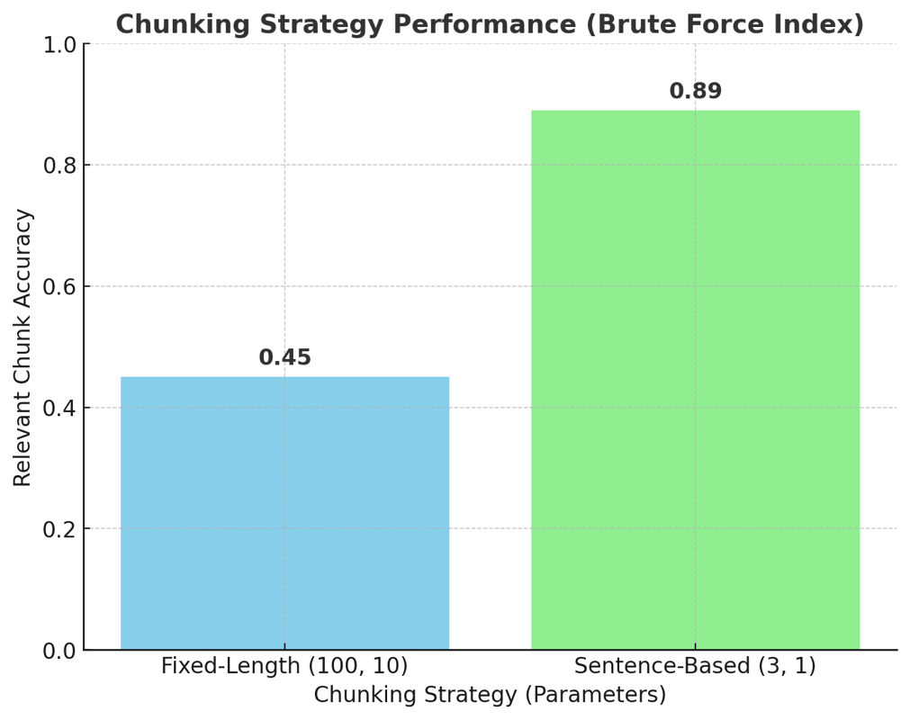
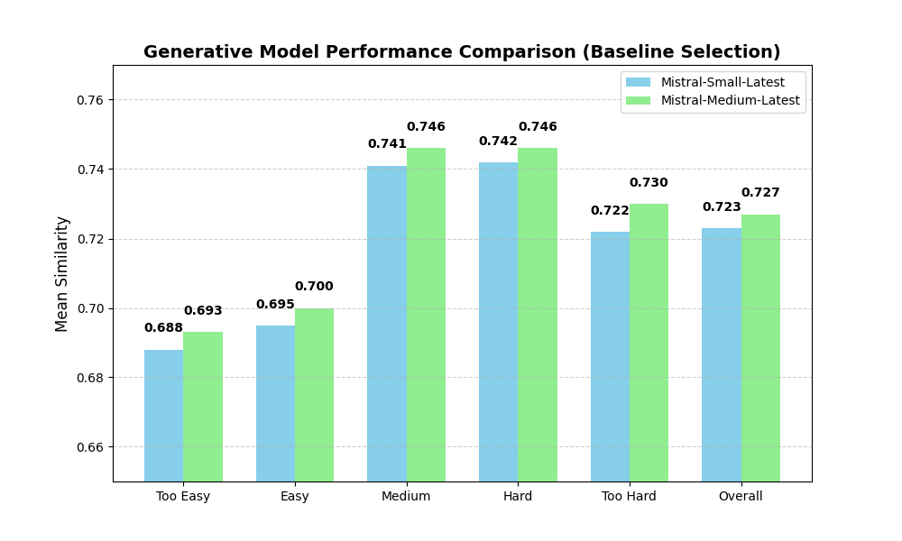
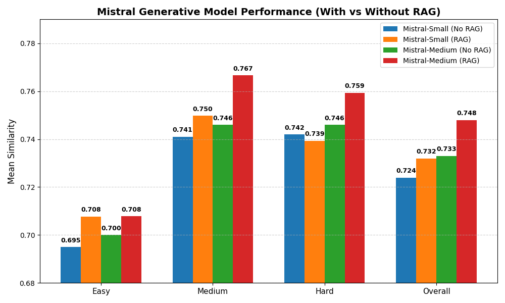
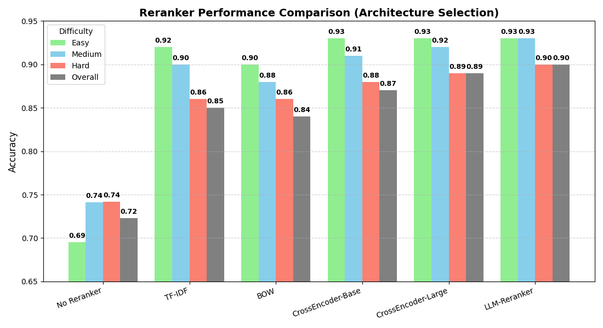
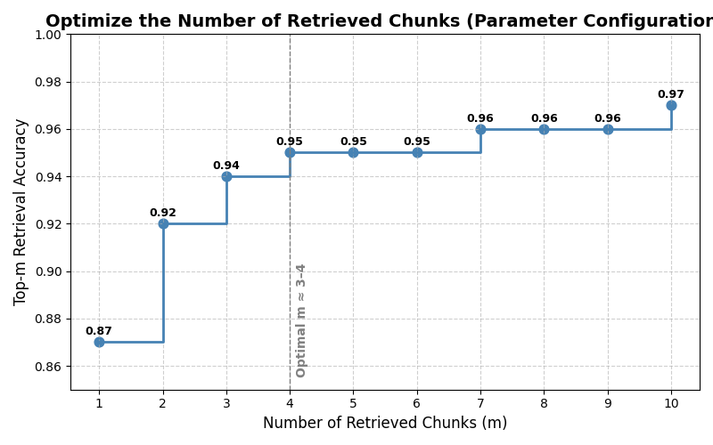

# Chunking Strategy Performance (Text Preprocessing and Index Selection)

**Figure 1** - The relevant chunk accuracy between fixed-length (100 characters per chunk, maximum 10 characters overlapping) and sentence-based (3 sentences per chunk, maximum 1 overlapping sentence) chunking strategies.

Figure 1 shows that sentence-based chunking performs with significantly higher accuracy (0.89) than fixed-length chunking (0.45). This improvement likely occurs because sentence-based chunking respects natural linguistic boundaries, keeping contextually related ideas together. In contrast, fixed-length chunking can arbitrarily split sentences or phrases, causing semantic fragmentation that reduces retrieval precision and overall contextual coherence. While sentence-based chunking dominates in performance, the tradeoff is speed. Its variable chunk sizes make indexing and storage less predictable, and sentence boundary detection adds preprocessing overhead. On the other hand, fixed-length chunking, although less contextually accurate, offers uniform sizes that simplify implementation, speed up indexing, and improve memory efficiency. Given the substantial accuracy gap between fixed-length and sentence-based chunking, the additional computational cost is justified, making sentence-based chunking the preferred approach.

# Generative Model Performance Comparison (Baseline Selection)

**Figure 2** - Generative Model Performance Comparison without RAG.

Figure 2 shows that for all question types, the Medium model consistently beats the Small model, likely because the Medium model’s larger parameter count enables it to capture more nuanced patterns in language and reasoning. This holds true even for questions that were relatively easy, which means that even these types of questions have enough nuanced patterns in language and reasoning that the small model cannot capture it all. As a result, it can generate more precise and contextually appropriate responses, while the Small model tends to produce shorter, less detailed outputs and sometimes misses subtle contextual cues that affect accuracy. While using the medium model is slightly more accurate, the tradeoff is speed and resources. The medium model has more parameters so will take more GPUs to run and inference may be slower. The verdict is to use the small model for speed while to use the medium model if that slight increase in accuracy is important.

# Retrieval-Augmented Generative Model Performance Comparison (Architecture Selection)

**Figure 3** - Mistral Model Performance with no RAG vs with RAG (No Reranker).

Figure 3 shows mixed results for the Small model, while the Medium model with RAG consistently outperforms its non-RAG counterpart. For easy and medium questions, the Small model benefits from RAG, achieving higher accuracy than without it. However, for harder questions and overall performance, the Small model with RAG performs worse. This may be because, when presented with additional retrieved information, the smaller model becomes overwhelmed or confused—its limited parameter capacity makes it less effective at integrating and reasoning over complex contextual data. The medium model, on the other hand, has more parameters so it does not have this struggle and therefore can perform with higher accuracy. As mentioned previously, the tradeoff to using the medium model is speed and resource usage. The verdict is to use the small model for easy questions 

# Reranker Performance Comparison (Architecture Selection)

**Figure 4** - Performance comparison between different types of rerankers.

Figure 4 shows LLM-Reranker outperforms all other rankers across models. In addition, while the accuracy in between reranker types have subtle differences, there is a significant improvement of accuracy when comparing any reranker with no reranker across all questions. This shows that using any reranker is generally worth the performance overhead tradeoff.

# Optimize the Number of Retrieved Chunks (Parameter Configuration)

**Figure 5** - Chunk retrieval accuracy vs number of retrieved chunks.

Figure 5 is a step plot showing the marginal increase of accuracy as we increase the number of retrieved chunks. The optimal number of retrieved chunks is at $m = 4$ where the marginal return from increasing the number of chunks is heavily diminished. This way, the performance and speed tradeoff is balanced. As more chunks are retrieved, accuracy may initially improve due to greater context coverage, but inference time increases and the model may become slower or distracted by irrelevant information.
